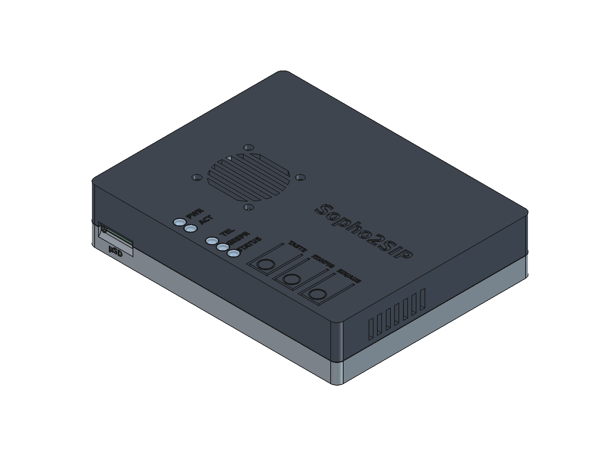

# Gehäuse für den CM4-Träger (FDM-Druck)

Zweiteiliges Gehäuse für `hardware/cm4` (Leiterplatte 110 × 85 mm), druckbar ohne Stützmaterial.
Außenmaß **115,6 × 90,6 × 25,1 mm**. Die Buchsen liegen hinten, Tasten und Anzeigen oben an der Vorderkante.



| Teil | Datei | Drucklage |
|---|---|---|
| Unterschale | `druck/unterschale.stl` | Boden auf dem Druckbett |
| Deckel | `druck/deckel.stl` | Oberseite auf dem Druckbett (kopfüber) |
| 5 Lichtleiter | `druck/lichtleiter_5x.stl` | Kopf auf dem Druckbett |

`gehaeuse.step` und `gehaeuse.FCStd` enthalten die Teile in Einbaulage.

## Aufbau

- **Trennebene** auf Höhe der Platinenoberseite. Die äußere Wandhälfte der Unterschale steht 2 mm hoch und greift
  in eine Stufe des Deckels; das zentriert den Deckel.
- **Verschraubung:** 4 × M2.5 von unten durch die Unterschale und die Bohrungen H1–H4 der Platine in
  Gewindeeinsätze der Deckelsäulen. Die Platine liegt auf Stützen und wird zwischen Stütze und Säule geklemmt.
  Unter jedem Taster stützt ein Zapfen die Platine gegen den Tastendruck.
- **Tasten** (SW1 Taste, SW2 Konfig, SW3 Ein/Aus): Biegezungen im Deckel (16 × 8 mm, von innen auf 1,2 mm gedünnt,
  Gelenk hinten). Der Stößel Ø 4 mm steht 0,35 mm über der Tasterkappe. Ein Ring markiert die Druckstelle.
- **Anzeigen** (D11 PWR, D10 ACT, D1 TEL, D2 GESPR, D3 STATUS): Lichtleiter Ø 3 mm in Röhren, die bis 0,6 mm über
  die LED reichen und Übersprechen zwischen den LEDs verhindern. Die Köpfe liegen bündig in Senkungen.
- **Buchsen hinten:** USB-C (Ausschnitt 12,4 × 6,6 mm für Steckertüllen), RJ45 LAN, 4P4C D340 PC, RJ12 D340 Audio;
  Beschriftung unter den Ausschnitten.
- **µSD vorn:** Schlitz mit Griffmulde. Die Karte (Push-Push) wird mit dem Fingernagel betätigt. Bei einem CM4 mit
  eMMC bleibt der Schlitz unbenutzt.
- **Kühlung:** Lüfter 30 × 30 × 7 mm unter dem Deckel über dem SoC des CM4 (3,9 mm Luft). Er saugt durch das Gitter
  im Deckel an und bläst auf das CM4; die Luft tritt durch die Schlitze in den Seitenwänden aus.
  Lüfter mit der Aufkleberseite zur Platine einbauen (Blasrichtung meist zum Aufkleber).
  Anschluss an J15 (JST PH, 2-polig).

## Zukaufteile

| Menge | Teil | Hinweis |
|---|---|---|
| 4 | Gewindeeinsatz M2.5, L 5,7 mm, Ø 4 mm (z. B. Ruthex RX-M2.5x5.7) | Loch Ø 3,6 × 6,5 mm |
| 4 | Zylinderschraube ISO 4762 M2.5 × 10 | Kopf versenkt (Ø 5,2 × 2,6 mm) |
| 1 | Lüfter 30 × 30 × 7 mm, 5 V, Stecker JST PH 2-polig | Lochabstand 24 mm |
| 4 | Blechschraube M3 × 8 … 10 (meist beim Lüfter) | von außen durch den Deckel |
| 4 | Klebefuß Ø ≤ 10 mm | Mulden 0,6 mm tief |

## Druck

- **Material:** PETG oder ASA (das CM4 erwärmt das Innere; PLA wird ab ~55 °C weich). Lichtleiter aus klarem PETG.
- Düse 0,4 mm, Schicht 0,2 mm, 3 Wandlinien, 20 % Füllung. Lichtleiter: 100 % Füllung, langsam.
- Kein Stützmaterial nötig. Beim Deckel liegen die Beschriftungen auf dem Druckbett; die vertieften Buchstaben
  werden in der ersten Schicht überbrückt.
- Die Biegezungen brauchen ein zähes Material (PETG/ASA). Ist die Taste zu schwer, `ZUNGE_D` verkleinern.

## Montage

1. Gewindeeinsätze mit dem Lötkolben in die vier Deckelsäulen setzen (PETG ~230 °C).
2. Lichtleiter von außen in den Deckel stecken (straff; notfalls ein Tropfen Klebstoff unter den Kopf).
3. Lüfter von innen an den Deckel schrauben.
4. CM4 auf den Träger stecken. Platine mit den Buchsen nach hinten in die Unterschale legen.
5. Lüfterkabel an J15 stecken, Deckel aufsetzen, von unten verschrauben. Klebefüße aufkleben.

## Erzeugen und prüfen

```
python3 hardware/gehaeuse/erzeuge_masse.py          # masse.json und platine_bestueckt.step (≈ 5 min) aus KiCad
flatpak run --command=freecadcmd org.freecad.FreeCAD $PWD/hardware/gehaeuse/freecad_gehaeuse.py
python3 hardware/gehaeuse/vorschau.py               # Querschnitte → vorschau_schnitte.png
xvfb-run -a -s "-screen 0 1600x1200x24" flatpak run org.freecad.FreeCAD $PWD/hardware/gehaeuse/freecad_ansichten.py
```

Alle Maße stehen als Konstanten am Anfang von `freecad_gehaeuse.py`. Die Bauteillagen kommen aus der Platine
(`masse.json`), die Bauteilhöhen aus dem bestückten STEP.

Das Skript prüft das Gehäuse gegen die bestückte Platine (`pruefung.txt`): keine Überschneidung, Stößel 0,35 mm
über den Tastern, Lüfter 3,87 mm über dem CM4. Die Querschnitte durch Taster, LED und Schraubsäule zeigt
`vorschau_schnitte.png`.

## Offen (nach dem ersten Druck prüfen)

- Passung der Gewindeeinsätze, der Lichtleiter (Bohrung 3,4 / Stab 3,0) und des Deckels auf dem Zentrierrand.
- Tastengefühl und Leerweg (`TASTE_SPIEL`, `ZUNGE_D`).
- Ob die Steckertüllen der eigenen USB-C- und RJ-Kabel in die Ausschnitte passen.
- Ob die Lüfterleistung reicht (Temperatur des CM4 unter Last mit `vcgencmd measure_temp`).
